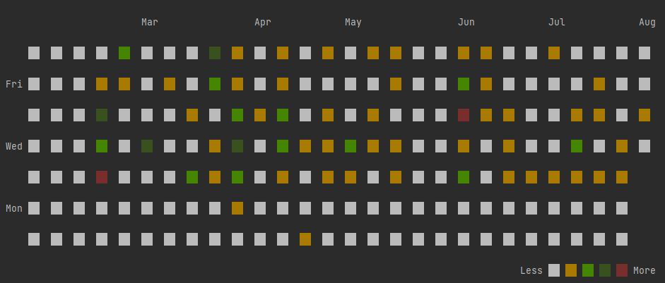

# git-local-stats

使用 Go 可视化本地 Git 提交信息

## 有 Go 环境
### 安装
```shell
go install github.com/git-zjx/git-local-stats
```
### 使用
```shell
# 添加需要统计的库的文件夹
git-local-stats add /path/to/folder
# 可视化某一贡献者的数据
git-local-stats stats 977904037@qq.com
```

## 无 Go 环境
### 安装
```shell
git clone https://github.com/git-zjx/git-local-stats.git
```
### 使用
```shell
cd git-local-stats/

# 添加需要统计的库的文件夹
git-local-stats add /path/to/folder # Linux
git-local-stats.exe add /path/to/folder # Windows
# 可视化某一贡献者的数据
git-local-stats stats 977904037@qq.com # Linux
git-local-stats.exe stats 977904037@qq.com # Windows
```

## 效果


## 来源
[这里这里](https://flaviocopes.com/go-git-contributions/)   
大体没有修改，只是改了显示的效果和命令执行的方式